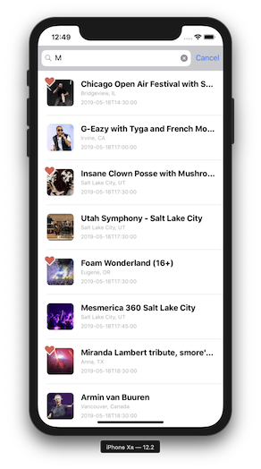
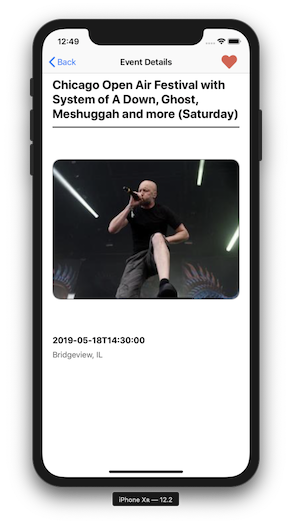

## HomeAway Coding Challenge

This example might help others understand how I think about building great software.

#### Summary

This implementation is a type ahead search app against the Seat Geek API. The type ahead updates a list of results as the search query changes. Results can be tapped to view them on a details screen. On the details screen the result can be favorited. On the type ahead screen, results matching the favorites list should show a visual indication that they are favorited.

#### Features

1. Type ahead search against the Seat Geek API
2. A detail screen so the user can drill down into a result
3. The detail screen allows the user to favorite/unfavorite the event
4. The type ahead results reflects the favorited state of each event
5. Favorited results are saved between launches of the app

#### Future Work / Known Issues

* Select images are not loading. It's possible that image URLs are not returned for these records from the API.
* Adjust search header / status bar styling to match comp
* Adjust detail header / navigation bar styling to match comp
* Test on multiple form factors
* Add more view controller unit tests
* Correct date formatting

#### Development

This project uses [Cocoapods](https://cocoapods.org/) for dependency management.

To build the project:

* Clone the repository: `git clone https://github.com/vincilbishop/iOS-Coding-Challenge.git`
* `cd iOS-Coding-Challenge`
* `pod install`
* `Open CodingChallenge.xcworkspace`

#### Screenshots

 
